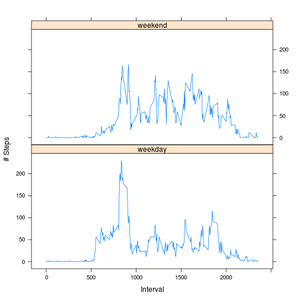

## Loading and preprocessing the data

```r
origActivity <- read.csv(unz("./activity.zip", "activity.csv"))
```

Removing rows with NAs

```r
activity <- na.omit(origActivity)
```

## What is mean total number of steps taken per day?

```r
steps <- tapply(activity$steps, activity$date, sum)
```

Here is a histogram of the total number of steps taken each day

```r
hist(steps, breaks = 20)
```

 


```r
totalMean <- mean(steps, na.rm=TRUE)
totalMedian <- median(steps, na.rm=TRUE)
```

The **mean** of the total number of steps taken per day is: 1.0766189 &times; 10<sup>4</sup>

The **median** of the total number of steps taken per day is: 10765

## What is the average daily activity pattern?

A time series plot (i.e. type = "l") of the 5-minute interval (x-axis) and the average number of steps taken, averaged across all days (y-axis)


```r
intervalAverageSteps <- tapply(activity$steps, activity$interval, mean)
plot(intervalAverageSteps, type="l", xlab="Time", ylab="Average Number of Steps", main="Average Daily Activity Pattern")
```

 

Which 5-minute interval, on average across all the days in the dataset, contains the maximum number of steps?


```r
maxInterval <- intervalAverageSteps[which.max(intervalAverageSteps)]
```
Interval with max steps starting at 835

## Imputing missing values

There are a number of days/intervals where there are missing values (coded as NA).

The presence of missing days may introduce bias into some calculations or summaries of the data.

### Calculate and report the total number of missing values in the dataset (i.e. the total number of rows with NAs)


```r
sum(is.na(origActivity$steps))
```

```
## [1] 2304
```

### Devise a strategy for filling in all of the missing values in the dataset. The strategy does not need to be sophisticated. For example, you could use the mean/median for that day, or the mean for that 5-minute interval, etc.

We can fill in the NA with the average value for the 5-min interval

### Create a new dataset that is equal to the original dataset but with the missing data filled in.


```r
library(plyr)
library(reshape2)
averagePerInterval <- ddply(activity, .(interval), summarise, steps=mean(steps))
filledActivity <- origActivity
for (i in 1:nrow(filledActivity)){
    if (is.na(filledActivity$steps[i])){
        filledActivity$steps[i] <- averagePerInterval$steps[which(filledActivity$interval[i] == averagePerInterval$interval)]}
}

filledActivity <- arrange(filledActivity, interval)
```

### Make a histogram of the total number of steps taken each day and Calculate and report the mean and median total number of steps taken per day. Do these values differ from the estimates from the first part of the assignment? What is the impact of imputing missing data on the estimates of the total daily number of steps?

Recalculating total steps per day

```r
totalPerDayFilled <- ddply(filledActivity, .(date), summarise, steps=sum(steps))
```


```r
hist(totalPerDayFilled$steps, breaks = 20, main="# Steps", xlab="Total # steps / day", ylab = "# Days")
```

 


```r
totalPerDay <- ddply(activity, .(date), summarise, steps=sum(steps))
mean(totalPerDay$steps) - mean(totalPerDayFilled$steps)
```

```
## [1] 0
```
No change in steps per day.


```r
medianDiff <- (median(totalPerDay$steps) - median(totalPerDayFilled$steps))/median(totalPerDay$steps)
```
Median changed by -1.1042074 &times; 10<sup>-4</sup>


```r
totalDiff <- sum(filledActivity$steps) - sum(activity$steps)
```

Increase of 8.6129509 &times; 10<sup>4</sup> is not surprising since we filled in missing values with averages.


## Are there differences in activity patterns between weekdays and weekends?

### Create a new factor variable in the dataset with two levels – “weekday” and “weekend” indicating whether a given date is a weekday or weekend day.


```r
Sys.setlocale("LC_TIME", "English")
```

```
## Warning in Sys.setlocale("LC_TIME", "English"): OS reports request to set
## locale to "English" cannot be honored
```

```
## [1] ""
```


```r
filledActivity$daytype <- weekdays(as.Date(filledActivity$date))
filledActivity$daytype <- ifelse(filledActivity$daytype %in% c("Saturday", "Sunday"),"weekend", "weekday")
```

### Make a panel plot containing a time series plot (i.e. type = "l") of the 5-minute interval (x-axis) and the average number of steps taken, averaged across all weekday days or weekend days (y-axis). See the README file in the GitHub repository to see an example of what this plot should look like using simulated data.


```r
intervalAvg <- ddply(filledActivity, .(interval, daytype), summarise, steps = mean(steps))
```


```r
library(lattice)
xyplot(steps ~ interval | daytype, data = intervalAvg, layout = c(1, 2), type="l", xlab = "Interval", ylab = "# Steps")
```

 
